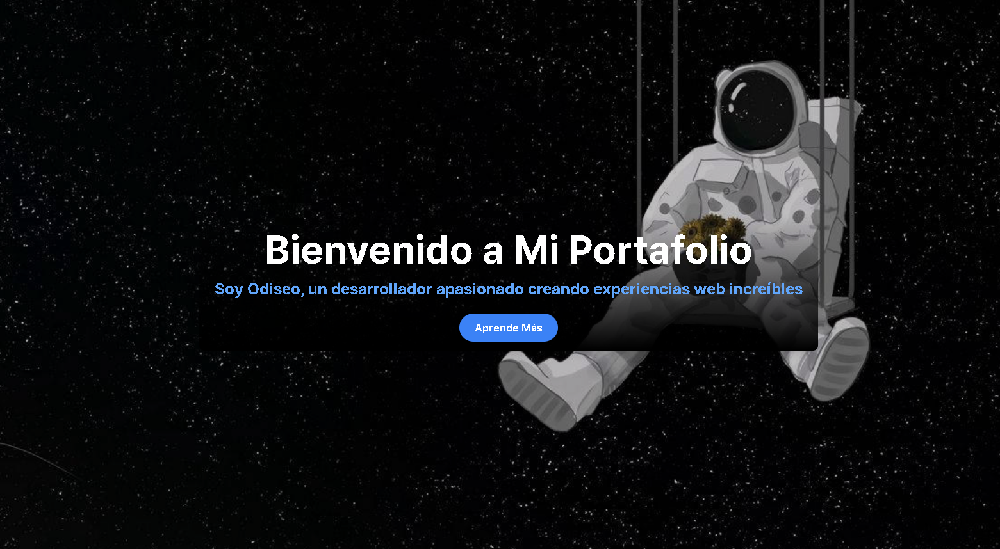
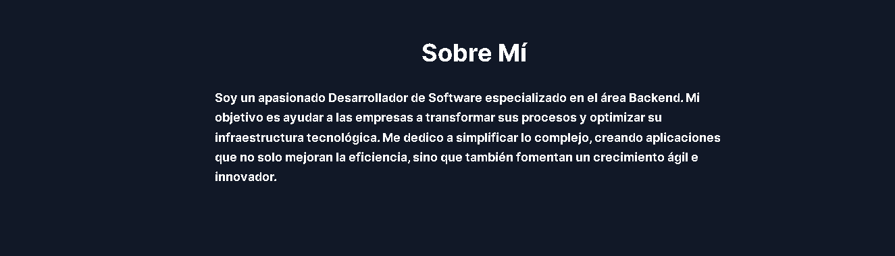
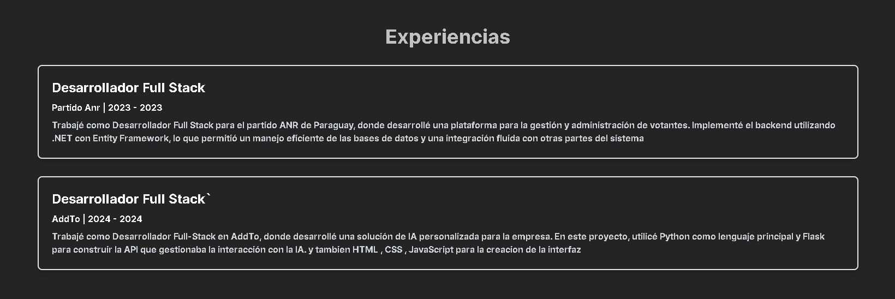
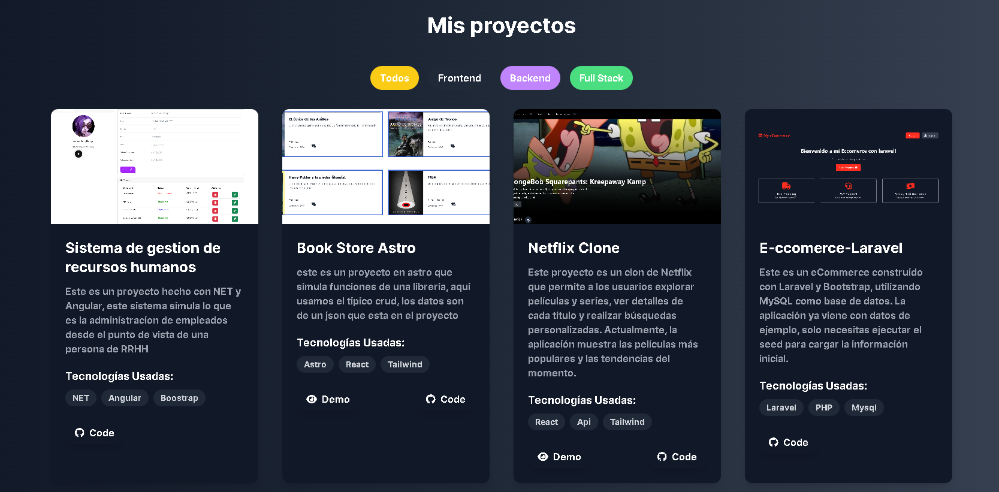
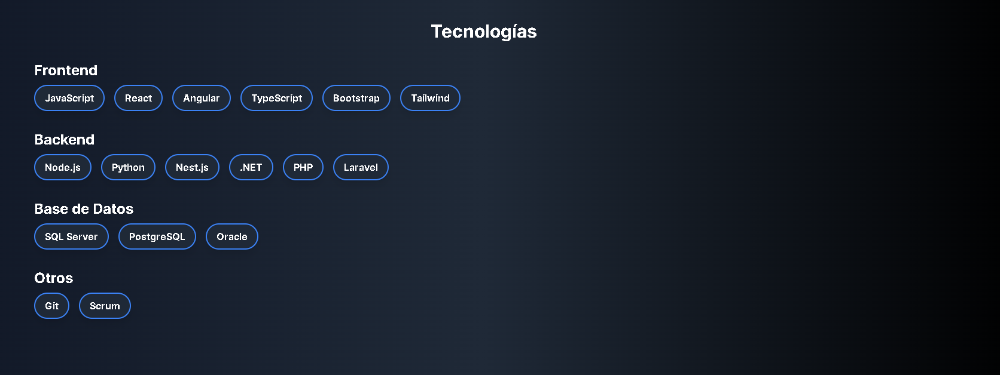

# Mi Portafolio

¡Bienvenido a mi portafolio! Aquí muestro mis habilidades y proyectos desarrollados utilizando **React** y **Tailwind CSS**. A continuación, encontrarás un resumen de las diferentes secciones de mi portafolio, junto con imágenes representativas.

## Contenido

- [Hero](#hero)
- [Sobre Mí](#sobre-mí)
- [Experiencias](#experiencias)
- [Proyectos](#proyectos)
- [Tecnologías](#tecnologías)

## Hero

En la sección Hero, presento una vista impactante que incluye mi nombre y una breve introducción sobre mí como desarrollador. Aquí, los visitantes encontrarán un llamado a la acción, como un botón para ver mi currículum o contactarme directamente.

## Sobre Mí

En la sección "Sobre Mí", comparto información personal y profesional, incluyendo mi pasión por la programación y mis objetivos como desarrollador. Esta sección también incluye mis datos de contacto, como mi correo electrónico y enlaces a mis perfiles de GitHub y LinkedIn.

## Experiencias

En esta sección, destaco mis experiencias laborales relevantes, describiendo mis roles y responsabilidades en diferentes proyectos. Aquí los visitantes podrán ver cómo he aplicado mis habilidades en entornos reales y los resultados que he logrado.

## Proyectos

En la sección de proyectos, presento una selección de trabajos destacados en los que he participado. Cada proyecto incluye una descripción, tecnologías utilizadas y enlaces para ver la demo y el código fuente en GitHub. Esta sección permite a los visitantes explorar mis capacidades y el tipo de soluciones que puedo ofrecer.

## Tecnologías

En la sección de tecnologías, enumero las herramientas y lenguajes que utilizo en mis proyectos. Esto incluye tanto las tecnologías de frontend como de backend, y proporciona una visión clara de mi conjunto de habilidades.

---

¡Gracias por visitar mi portafolio! Si tienes alguna pregunta o deseas saber más sobre mis proyectos, no dudes en contactarme.
